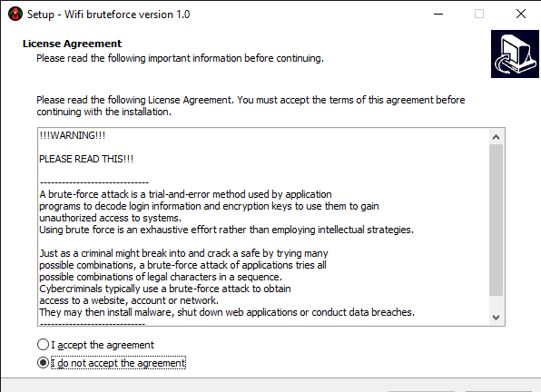
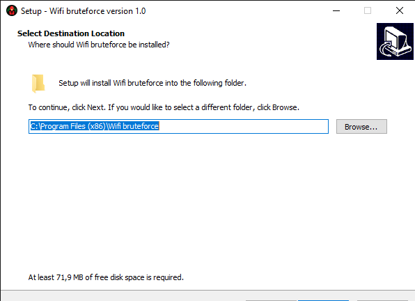
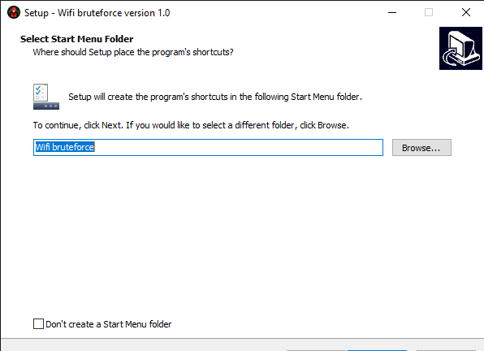
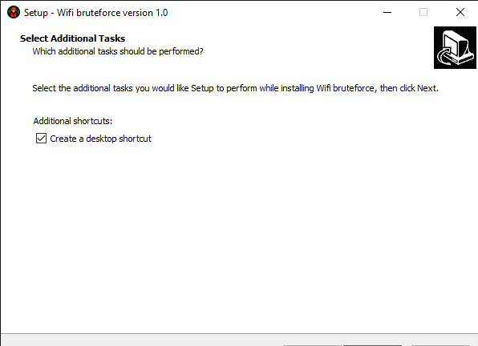
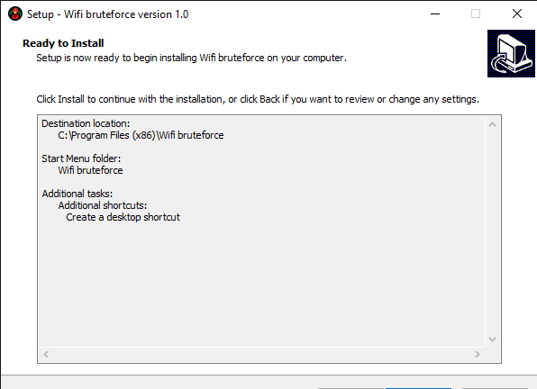

# Wifi Bruteforce (version 2.0)

  

- [Wifi Bruteforce (version 2.0)](#wifi-bruteforce-version-20)
  - [Introduction](#introduction)
  - [What's New](#whats-new)
  - [Python Installation](#python-installation)
    - [Windows](#windows)
    - [macOS](#macos)
    - [Linux](#linux)
      - [Ubuntu and Debian](#ubuntu-and-debian)
      - [Fedora](#fedora)
      - [CentOS](#centos)
  - [Installation](#installation)
    - [1.0](#10)
      - [Install](#install)
      - [How to use?](#how-to-use)
      - [Wifi bruteforce menu (Password generator)](#wifi-bruteforce-menu-password-generator)
    - [2.0](#20)
      - [Windows](#windows-1)
  - [Contact](#contact)

## Introduction
This is a program for Wifi password brute-forcing that allows you to test the security of your network and assess the strength of your passwords. Version 2.0 comes with significant improvements compared to the previous version, including bug fixes, a complete program redesign, and the addition of a user interface.

## What's New

| Version | Improvements|
|--------|----------------------------------------------|
| 1.0    | Slightly accelerated the cracking process     |
| 2.0    | Fixed numerous bugs, completely redesigned the program, added a user interface (in console), significantly accelerated the cracking process using threads, making a program for many OS (including Windows, MacOS, Linux, etc.)|

## Python Installation

The Wifi Bruteforce program is written in Python, so you will need to install Python if you don't have it already. Here's a step-by-step guide to installing Python on different operating systems:

### Windows

1. Go to the official Python website: [https://www.python.org/downloads/windows/](https://www.python.org/downloads/windows/).
2. Download the Python installer that matches your operating system version (32-bit or 64-bit).
3. Run the downloaded installer.
4. Make sure to check the "Add Python to PATH" option.
5. Click the "Install Now" button and follow the on-screen instructions.
6. Once the installation is complete, Python will be successfully installed on your computer.

### macOS

1. Go to the official Python website: [https://www.python.org/downloads/mac-osx/](https://www.python.org/downloads/mac-osx/).
2. Download the Python installer for macOS.
3. Run the downloaded installer.
4. During the installation, make sure to check the "Install launcher for all users" and "Add Python to PATH" options.
5. Click the "Install Now" button and follow the on-screen instructions.
6. Once the installation is complete, Python will be successfully installed on your computer.

### Linux

Python is usually pre-installed on most Linux distributions. If you don't have it, you can install it through your package manager. Here are some examples of commands to install Python on popular distributions:

#### Ubuntu and Debian

    sudo apt update
    sudo apt install python3

#### Fedora

    sudo dnf install python3

#### CentOS

    sudo yum install python3

## Installation
1. Download the Wifi Bruteforce program from the Releases section of this repository. (recommended last, 2.0), if you using windows, you can download the 1.0 version but 1.0 works only on Windows 
2. Extract the zip file with program and use the menu in top to navigate the guide
### 1.0
Requirements:
> Python 3 install from [this site](https://python.org)
> Module pywifi (using pip install pywifi in terminal)
> Module tkinter (using pip install tkinter in terminal)
***
#### Install
1. Launch the setup.exe file and choose the language
2. After selecting the language and continuing, the following window should appear:

If such a window appears as in the photo above, then you must confirm the terms of the license and continue
3. After clicking the "continue" button, you must specify the path where to save

4. Select start menu folder (or you can use deafult name)

5. You must check the "create a desktop shortcut" box, because if you do not check it, you will have to look for the program in the folder where you installed it, if you have checked it, then a shortcut to the program will appear on your desktop. Do as in the photo

6. Check if everything you specified is correct

7. Final step: Click "install" and wait until the program is installed
***
#### How to use?
After installation, a shortcut will appear on the desktop such as in the photo below:

1. Launch the program by double-clicking on the program's shortcut
After starting the program, the following window will appear:

***
#### Wifi bruteforce menu (Password generator)
Click button "Password generator" and wait for the generator to start, if the program has started, the following window should appear:

Input how many passwords generate and click Enter
Then password lenght and click Enter
Wait for end of henerating and click Enter
Paswwords that you generate stored in file "passwords.txt"
***
Wifi bruteforce menu
If you want to hack the WIFI you can use the "Wifi bruteforce"
Before we can start read this license:
***
    !!!WARNING!!!

    PLEASE READ THIS!!!

    A brute-force attack is a trial-and-error method used by
    application
    programs to decode login information and encryption keys to use them to gain 
    unauthorized access to systems. 
    Using brute force is an exhaustive effort rather than employing intellectual strategies.

    Just as a criminal might break into and crack a safe by trying many 
    possible combinations, a brute-force attack of applications tries all 
    possible combinations of legal characters in a sequence. 
    Cybercriminals typically use a brute-force attack to obtain 
    access to a website, account or network. 
    They may then install malware, shut down web applications or conduct data breaches.

    PLEASE USE THIS PROGRAM ONLY FOR GOOD!
***
After reading launch the Wifi brutforce menu and start the wifi bruteforce program
If you don't install requirements the window will closed
Or if you install all, this window should appear:

On this photo you can see targets with numbers, strenght and SSID of wifi
You must choose the target (input only № of Wifi)
Confirm, and click Enter
Then we must input the filename of our textfile with passwords
To use deafult lib that was downloaded with program input "Cracklib.txt" (with format!)
Click Enter and wait
If password is true the program closed and connect you to the Wifi
How to crack Wifi using the generated passwords?
Generated passwords stored in file "passwords.txt"
Input "passwords.txt" instead of "Cracklib.txt"

### 2.0
#### Windows
Open cmd and check that you install the git

    git --version

If you get an error install git with [this link](https://git-scm.com/downloads)

After installing git write in cmd

    git clone https://github.com/DenTs123/Wifi-bruteforce/
    cd Wifi-bruteforce/Versions/2.0/Windows
    python main.py

After this you can see the Wifi bruteforce menu

Watch the tutorial how to brute the wifi
<iframe scr="https://www.youtube.com/watch?v=et7DR4KaLk4"></iframe>

## Contact

The author of the Wifi Bruteforce program is [@Opasniy_chel](https://t.me/Opasniy_chel). If you have any questions or suggestions for improving the program, feel free to contact the author.

---

**Important**: Wifi password cracking is illegal and violates privacy and property rights. Please use this program only for testing your own network security or with the permission of the network owner.
